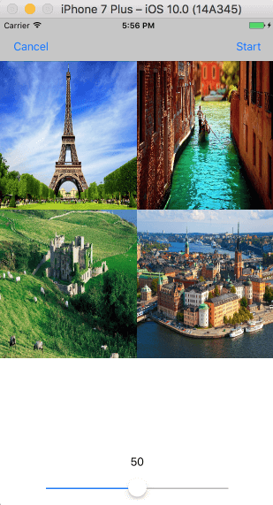
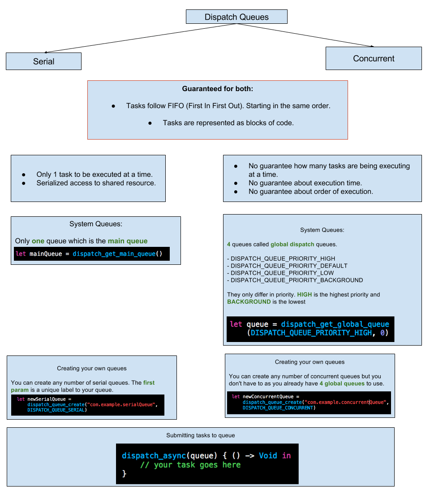

# swift3 concurrency
This repo is the steps breaking down from this [excellent tutorial][1] and an update for swift3 + xcode8. I seperated each step into its own commit, you can check the commit history for details.

The major difference is on GCD part, for NSOperation part, the changes are minor.



## A compact example
Example from [here][2]

qos - new quality of service syntax

weak self - to disrupt retain cycles

async global background queue - for network query

async main queue - for touching the UI.

Of course you need to add some error checking to this...

```swift
DispatchQueue.global(qos: .background).async { [weak self]
  () -> Void in
  self?.flickrPhoto.loadLargeImage {
      loadedFlickrPhoto, error in
      if error != nil {
          print("error:\(error)")
      } else {
      
          DispatchQueue.main.async {
              () -> Void in
              activityIndicator.removeFromSuperview()
              self?.imageView.image = self?.flickrPhoto.largeImage
          }
      }
  }
}
```
## Swift2 GCD cheatsheet



## get main queue
swift2 version:

    dispatch_get_main_queue()
    
swift3 version:

    DispatchQueue.main    

## global concurrent queue
swift2 version:

    let queue = dispatch_get_global_queue(DISPATCH_QUEUE_PRIORITY_DEFAULT, 0)

swift3 version:

    let queue = DispatchQueue.global(qos: .default) 

## custom serial queue
swift2 version:

    let queue = dispatch_queue_create("com.cyper.xxx", DISPATCH_QUEUE_SERIAL)

swift3 version:

    let queue = DispatchQueue(label: "com.cyper.xxx")
    
DispatchQueue by default is serial queue, you don't have to specify it in the initializer.

## custom concurrent queue
swift2 version:

    let queue = dispatch_queue_create("com.cyper.xxx", DISPATCH_QUEUE_CONCURRENT)

swift3 version:

    let queue = DispatchQueue(label: "com.cyper.xxx", qos: .userInitiated, attributes: .concurrent)

## NSOperationQueue
1. Removed the `NS` prefix
2. Simplified the method name
3. You can use xcode auto-fix

## References
http://www.appcoda.com/ios-concurrency/

https://medium.com/swift-and-ios-writing/a-quick-look-at-gcd-and-swift-3-732bef6e1838#.ueryj2b2h

https://www.logcg.com/archives/2040.html

http://stackoverflow.com/questions/37805885/how-to-create-dispatch-queue-in-swift-3

## code

https://github.com/uniquejava/iOSConcurrencyDemo/blob/master/iOSConcurrencyDemo/ViewController.swift

[1]: http://www.appcoda.com/ios-concurrency/
[2]: http://stackoverflow.com/questions/37805885/how-to-create-dispatch-queue-in-swift-3


